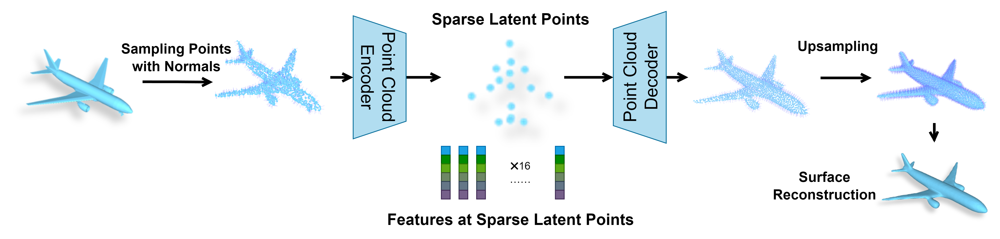
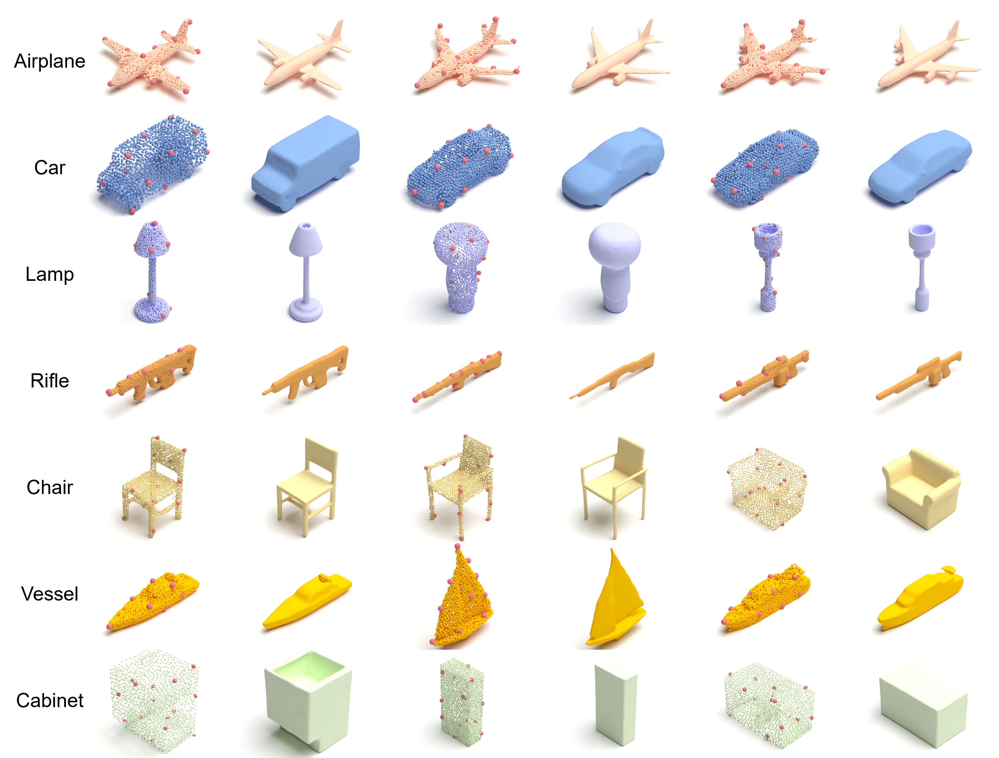

# SLIDE: Controllable Mesh Generation Through Sparse Latent Point Diffusion Models
This repo intends to release code for our work: 

Zhaoyang Lyu\*, Jinyi Wang\*, Yuwei An, Ya Zhang, Dahua Lin, Bo Dai, ["Controllable Mesh Generation Through Sparse Latent Point Diffusion Models"](https://arxiv.org/abs/2303.07938).

\* Equal contribution

Project papge is [here.](https://slide-3d.github.io/)

**S**parse **L**atent po**I**nt **D**iffusion mod**E**l (**SLIDE**) is a mesh generative model based on latent diffusion models.
SLIDE encodes a 3D shape to a sparse set of latent points with features, and train diffusion models in this latent space.
Samples generated in this latent space are decoded back to point clouds by a neural decoder, and then meshes can be recontructed from the point clouds through [SAP](https://arxiv.org/abs/2106.03452). Below is an overview of the framework of SLIDE:

Some point clouds and meshes generated by SLIDE:

## Code coming soon...
